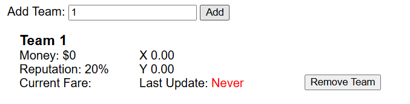
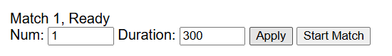
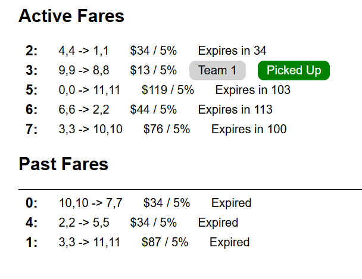

# Vehicle Positioning and Fare System (VFPS)

This repository is the official Vehicle Positioning and Fare System for use in ELEC 390.

It is for use by the competition, but also for at-home and in-lab testing of teams' vehicles.

The core module is the main VFPS server. There will be additional modules added for differing modes of vehicle positioning and score display.

## At-Home Use

### Setup with PyCharm
This project was developed in PyCharm community, so you should be able to eimply open it and run from there.

To launch the VPFS server, simply select the VPFS configuration in the top right and run it.

To test your server, run the command
```commandline
curl localhost:5000
```
And you should see the response `VFPS is alive`

### Setup with Manual Install
The project was designed for Python 3.12. Using either a fresh install or conda environment, you can install the required pip packages by running 
```commandline
pip install -r requirements.txt
```
In the project's root directory.

Now switch to the VPFS directory and start the program with the command.
```commandline
python3 Router.py
```
To test your server, run the command
```commandline
curl localhost:5000
```
And you should see the response `VFPS is alive`

### Connecting your Vehicle
To connect your vehicle to the VPFS, make sure they are both on the same network.

You'll need to know the IP address of your computer. To obtain it (on windows), run the `ipconfig` command. In the resulting output, look for your IPv4 address. It will be in the form `x.x.x.x`, and  most home networks it'll look like `192.168.x.x` or `10.x.x.x`.

Now on your vehicle, run the following command to test the connection, replacing `[YOUR IP]` with the address we just got.
```commandline
curl [YOUR IP]:5000
```
 If everything is working, you should once again see `VFPS is alive`. If this test worked in setup but failed now, it could be one of a few causes
- Your vehicle is on a different network
- You entered/have the wrong IP address
- Your server is blocked by a firewall / not accessible outside of localhost

If you have issues at this step, you can ask for help on OnQ. Make sure to include the following:
- Output of `curl localhost:5000`
- Output of `ipconfig`
- Output of `curl [YOUR IP]:5000`

Once you have an established connection, use this IP address as the server address in your code.

### Dashboard Configuration
Once the VPFS server is running, go to https://localhost:5000/static/dashboard.html to view the dashboard.
This will provide an overview of the current active match, teams, and fares.

To add your team to the current "match", simply enter your team number and press add. You should see a new entry appear.


Now set the match number and duration above. If you just want to test how your vehicle responds to fares you can set the match duration to some very large number so it runs forever. If you want to test how your veihcle responds to match start/finish, then use a smaller number.

The duration input is provided in seconds, so a 5-minute test match would have a duration of 300.

Click the "Apply" button to load the match config, and then the start button when you are ready to test.


### Fare Information
The dashboard provides you with quite a bit of information about the state of fares, since it's designed to help us make sure things are running smooth at competition.

Fare information is provided as follows:
```
Fare Number:    From(x,y) -> To(x,y)   $Pay / Rep%  Expiry  [Status Badges]
```
This allows you to see which fares your vehicle is being offered, which one you have claimed, and how you are progressing through it.


### Vehicle Positioning
Currently there is no at-home support for running the camera-based positioning system. It is in the works and should be available soon.

In the meantime, or for those who don't have the space or need to set up a full simulation, you can use the dummy WhereAmI system. This allows you to simply enter the coordinates you want the system to think your vehicle is at.

To launch the dummy system, either select `WhereAmI Dummy` from the PyCharm run dropdown or run `python3 WhereAmI.py` in the `WhereAmI_Dummy` folder.

In your console, you'll be prompted to enter a team number. This way you only need to enter it once.

Now simply enter your desired coordinates in the format `x,y` (so to go to x=1.5, y=2 you'd enter `1.5,2`). This will send a signal to the VPFS server which moves your vehicle to that position. Now you can keep entering new coordinates to move your vehicle however you want for testing. To repeat the last coordinate but update the timestamp, just press the enter key with no input.

### Simulating a full fare
To simulate a full fare, you just have to move your vehicle twice.

1. See which fare your vehicle has claimed on the dashboard
2. Enter the coordinates for the start location in the WhereAmI Dummy console
3. You should see the fare status show `In Position`. Wait for it to show `Picked Up`
4. Now enter the coordinates for the end location
5. You should see the fare status show `In Positoin` again. Wait for completion
6. When the fare has completed, it will move down and should show the `Completed` and `Paid` badges
7. You should see your team's balance and reputation have been updated